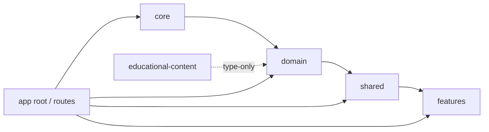

# Architecture

NeuralLab is a static Angular single-page application that teaches Machine
Learning and TensorFlow.js through 16 guided laboratories. Everything runs in
the browser; there is no backend and no server runtime. This document describes
the workspace layout, layer boundaries, runtime services, lab/content
architecture, persistence and deployment.

It is grounded in the OpenSpec specifications under
[`openspec/specs/`](../openspec/specs/) — primarily `technical-architecture`,
`laboratory-architecture`, `domain-model` and `information-architecture` — and
in the implementation under `src/app/`.

## 1. Workspace layout

```text
src/
├── app/
│   ├── core/                    # Leaf layer: no internal layer imports
│   │   ├── data/                # LocalStorageService
│   │   ├── images/              # Image decoding + tensor helpers
│   │   ├── tfjs/                # TF.js init, token, memory, serializer
│   │   ├── training/            # Training worker + protocol
│   │   ├── ui/                  # Design-system primitives (Button, Card, …)
│   │   └── utils/               # Pure functions (math, regression, neural net)
│   ├── domain/                  # Domain models and aggregates
│   │   ├── content/             # Zod schemas + derived types (schemas.ts)
│   │   ├── models/              # LabSummary / lab model types
│   │   └── progress/            # ProgressService, migrator, types
│   ├── shared/                  # Reusable presentational/runtime building blocks
│   │   ├── challenges/          # Pure challenge validation
│   │   ├── code-view/           # CodeGeneratorService
│   │   ├── concepts/            # Concept registry, linker, modal
│   │   ├── experiments/         # ExperimentRegistry + ExperimentFn contract
│   │   ├── runtime/             # LabRuntimeService
│   │   ├── stages/              # Base stage components + ComponentRegistry
│   │   └── visualizations/      # Visualization components + registry
│   ├── features/                # Routed feature areas
│   │   ├── glossary/
│   │   ├── journey/             # Journey, catalog, progress dashboard
│   │   ├── lab-shell/           # Shell, stage navigator/renderer, panel
│   │   ├── labs/                # 16 lazy lab features + labRoute + labs.routes
│   │   ├── main-layout/
│   │   ├── settings/
│   │   └── tfjs-status/
│   ├── educational-content/     # Pure data (TypeScript consts)
│   │   ├── concepts/            # Concept definitions
│   │   └── lab-configs/         # LaboratoryConfig objects + lab-catalog
│   ├── app.config.ts            # Providers (router, TF.js init)
│   ├── app.routes.ts            # Top-level routes
│   └── app.ts                   # Root standalone component
├── main.ts
└── styles.css                   # Tailwind 4 entry + theme CSS variables

scripts/
├── serve-dist.mjs               # dependency-free static server for Playwright
└── validate-content.mjs         # build-time content validation (Node)
```

## 2. Layer boundaries

Dependencies flow in one direction, and ESLint stops violations at the source.



| Layer | May import from |
| --- | --- |
| `core` | nothing inside `src/app` (leaf) |
| `domain` | `core` |
| `shared` | `core`, `domain` |
| `features` | `core`, `domain`, `shared`, `educational-content` |
| `educational-content` | `domain` types only (pure data at runtime) |

The rules are enforced with `@typescript-eslint/no-restricted-imports` in
[`eslint.config.js`](../eslint.config.js). `educational-content` configs are
typed with the domain schemas, so type-only domain imports are allowed while
runtime imports are not.

### Path aliases

[`tsconfig.json`](../tsconfig.json) defines the aliases used across the codebase:

| Alias | Maps to |
| --- | --- |
| `@core/*` | `src/app/core/*` |
| `@domain/*` | `src/app/domain/*` |
| `@shared/*` | `src/app/shared/*` |
| `@features/*` | `src/app/features/*` |
| `@content/*` | `src/app/educational-content/*` |

## 3. Angular application architecture

- **Bootstrap**: `src/main.ts` calls `bootstrapApplication(App, appConfig)`.
  [`app.config.ts`](../src/app/app.config.ts) registers
  `provideBrowserGlobalErrorListeners`, `provideRouter(routes, withHashLocation())`,
  the `TFJS_TOKEN` factory, the TF.js app initializer, the reduced-motion
  preference initializer and the concept-registry seeder.
- **Standalone + zoneless**: components are standalone and the project keeps its
  zoneless change-detection strategy; `provideZoneChangeDetection` is not used.
  UI state is signal-based (`signal`, `computed`, `effect`).
- **Routing + lazy loading**: [`app.routes.ts`](../src/app/app.routes.ts) mounts a
  `MainLayoutComponent` shell with `jornada`, `laboratorios`, `glossario`,
  `progresso`, `configuracoes`, `tfjs-status` and a lazily loaded `lab` child
  route. `**` redirects to the journey. Hash location (`withHashLocation()`) is
  required because the app ships as a static GitHub Pages project site.
- **Global progress state**: `ProgressService` (root) exposes a read-only
  `signal<ProgressState>`.

## 4. TensorFlow.js integration

TF.js is loaded lazily and injected through a token so consumers and tests never
depend on the concrete module.

- **Lazy loader** — [`core/tfjs/tfjs.loader.ts`](../src/app/core/tfjs/tfjs.loader.ts)
  holds `setTfjs`/`getTfjs`/`isTfjsLoaded`. `TfjsModule` is `typeof import('@tensorflow/tfjs')`,
  so the module stays out of the initial bundle.
- **Initialization** —
  [`core/tfjs/tfjs-init.service.ts`](../src/app/core/tfjs/tfjs-init.service.ts)
  dynamically imports TF.js and selects a backend following
  `TFJS_BACKEND_PRIORITY = ['webgpu', 'webgl', 'cpu']`, calling `tf.ready()` and
  logging the selected backend. It never rejects: on total failure it returns
  `null` and the app continues.
- **Injection token** — `TFJS_TOKEN`
  ([`core/tfjs/tfjs.token.ts`](../src/app/core/tfjs/tfjs.token.ts)) resolves to the
  loaded module; [`app.config.ts`](../src/app/app.config.ts) wires it with
  `useFactory: getTfjs`. Tests provide a fake `tf` through this token.
- **Memory management** —
  [`core/tfjs/tfjs-memory.service.ts`](../src/app/core/tfjs/tfjs-memory.service.ts)
  centralizes lifecycle: `tidy()`, `track()`, `disposeAll()`,
  `getMemorySnapshot()` and `watchMemory(budgetMB, onWarning, onCritical)`
  (warning at 80%, critical at 95% by default).
- **Serialization** —
  [`core/tfjs/tensor-serializer.service.ts`](../src/app/core/tfjs/tensor-serializer.service.ts)
  turns tensors into `TensorSnapshot` (`shape`, `dtype`, sampled `values`,
  `stats`, `size`, `truncated`) and layers models into `ModelSnapshot`, reading
  values inside `tf.tidy`.
- **Training worker** —
  [`core/training/training-worker.service.ts`](../src/app/core/training/training-worker.service.ts)
  runs multi-epoch training off the main thread (`run()` for gradient descent,
  `runNetwork()` for classification) and streams metrics as an Observable. When
  Web Workers are unavailable it falls back to the main thread. The worker is
  created through `TRAINING_WORKER_FACTORY` so tests can substitute a fake.

### Per-lab runtime

[`shared/runtime/lab-runtime.service.ts`](../src/app/shared/runtime/lab-runtime.service.ts)
is deliberately **not** `providedIn: 'root'`: a lab route provides one instance,
so Angular destroys it when the user leaves the lab. It exposes `tf`, `tidy`,
`track`, `createTensor`, `getSnapshot`, `getMemorySnapshot`,
`setExperimentState`/`getExperimentState`, the `computations$` stream consumed by
the "Por baixo dos panos" panel, and `dispose()` (which disposes every tracked
tensor and clears state).

## 5. Laboratory architecture

### Lab as a lazy feature

Each laboratory is a standalone, lazy-loaded feature under
`src/app/features/labs/lab-NN-*`. A feature contains:

- `lab-NN-*.config.ts` — re-exports the content config from
  `@content/lab-configs/lab-NN-*` as `LAB_NN_*_CONFIG`.
- `lab-NN-*.experiments.ts` — the lab's `ExperimentFn` implementations.
- `lab-NN-*.routes.ts` — exports `LAB_NN_*_ROUTES` built with `labRoute(...)`.
- `index.ts` — exports the config and route array.

### Route wiring

[`features/labs/lab-route.ts`](../src/app/features/labs/lab-route.ts) builds a
route that:

1. provides a fresh `LabRuntimeService`,
2. provides the lab config under `LAB_CONFIG`,
3. lazily registers the lab's experiment functions via `provideExperiments(...)`,
4. lazy-loads `LabShellComponent`.

[`features/labs/labs.routes.ts`](../src/app/features/labs/labs.routes.ts)
registers each concrete lab route **before** the generic `:slug` fallback. The
fallback resolves an unknown slug to a not-found state; every implemented lab has
an explicit route.

### Shell, stages and registries

- `LabShellComponent` reads `LAB_CONFIG`, wires the progress/analytics tracking,
  reacts to the `?stage=` query parameter for deep links, and composes the
  header, stage navigator, stage renderer and the panel.
- `StageRendererComponent` resolves `StageConfig.component` through
  `ComponentRegistry`
  ([`shared/stages/component-registry.service.ts`](../src/app/shared/stages/component-registry.service.ts)),
  which registers the six base keys: `markdown`, `concept-card`,
  `visualization`, `experiment`, `challenge`, `code-view`.
- `VisualizationStageComponent` resolves `visualizationType` through
  `VisualizationRegistry`
  ([`shared/visualizations/visualization-registry.service.ts`](../src/app/shared/visualizations/visualization-registry.service.ts)).

### Stage contract

Stage components implement the contract in
[`shared/stages/stage-contract.ts`](../src/app/shared/stages/stage-contract.ts):
they receive `config` (and, for interactive stages, `runtime`) and emit
`stageComplete` with `{ type, index, success? }`. The ten pedagogical stage
types and their PT-BR labels live there too; see
[`learning-path.md`](learning-path.md).

## 6. Content architecture

Content is **declarative TypeScript**, not a CMS. The single source of truth for
the runtime/validation contract is
[`domain/content/schemas.ts`](../src/app/domain/content/schemas.ts), which
defines Zod schemas (and infers the TypeScript types) for:

- `STAGE_TYPES` (`contextualizacao` … `resumo`) and `STAGE_COMPONENT_KEYS`;
- `parameterConfigSchema` — parameter types `number`, `string`, `boolean`,
  `tensor-shape`, `image`;
- `experimentConfigSchema` — `experimentFnId`, `parameters`, `visualization`,
  `constraints`, `defaultState`;
- `visualizationConfigSchema` — `type`, `props`, `interactions`, `accessibility`;
- `challengeValidationSchema` — a discriminated union over the five challenge
  types;
- `stageConfigSchema` — with cross-field refinements (visual stages require
  `visualizationType` + `initialData`; `experimentacao` requires an
  `experimentConfig`; `desafio` requires `validation`; `codigo` requires
  `codeTemplate` or `generationStrategy`);
- `laboratoryConfigSchema` — `id`, `number` (1–16), `slug`, `title`,
  `description`, `estimatedMinutes`, `prerequisites`, `concepts`, `category`,
  `memoryBudgetMB` (≤ 500), `tags`, `stages`;
- `conceptSchema`.

The schema module is intentionally self-contained (only `zod` plus type-only
imports) so the Node validator can import the `.ts` source directly.

### Build-time validation

[`scripts/validate-content.mjs`](../scripts/validate-content.mjs) is wired into
`npm run validate:content` and the CI gate. It imports every
`lab-configs/lab-NN-*.ts`, then checks:

- schema conformance (`laboratoryConfigSchema.safeParse`);
- visualization stages reference a known `VISUALIZATION_TYPES` entry;
- `id`, `number` and `slug` are unique;
- `number`, `slug`, `title`, `description` and `category` match
  [`lab-catalog.ts`](../src/app/educational-content/lab-configs/lab-catalog.ts);
- referenced prerequisites exist and referenced concepts have a definition
  (`validateLaboratoryReferences` in `schemas.ts`).

It exits non-zero on errors and prints a JSON report.

### Concepts and glossary

Concept definitions live in
[`educational-content/concepts/concepts.ts`](../src/app/educational-content/concepts/concepts.ts)
and are seeded into `ConceptRegistry` at startup. Lab configs reference concept
ids; the glossary, concept cards and inline links are all derived from the same
definitions. See [`learning-path.md`](learning-path.md) for the concept
relationships.

## 7. Experiments and challenges

### Experiment contract

`ExperimentFn` and `SyncExperimentFn`
([`shared/experiments/experiment-registry.ts`](../src/app/shared/experiments/experiment-registry.ts))
receive `(params, runtime)` and return an `ExperimentResult`:

```ts
interface ExperimentResult {
  tensors?: Tensor[];                  // published to the panel
  visualizationData?: VisualizationData;
  codeSnippet?: string;
}
```

An `ExperimentFn` may also return an `Observable<ExperimentResult>` so
worker-based training can stream epoch-by-epoch results. Every tensor must be
created through `runtime.tidy()` or `runtime.track()`.
`ExperimentRegistry` maps `ExperimentConfig.experimentFnId` to the implementation,
registered lazily per lab route by `provideExperiments(...)`.

### Challenge validation

[`shared/challenges/challenge-validator.ts`](../src/app/shared/challenges/challenge-validator.ts)
implements pure validation for the five challenge types: `parameter-match`,
`tensor-value` (shape + values within tolerance), `code-output`,
`multiple-choice` and `free-form` (required-term matching in V1).

## 8. Visualization engine

The registered visualization types (in the `VisualizationRegistry` constructor)
are `tensor-grid`, `matrix-heatmap`, `line-chart`, `scatter-plot`,
`activation-curve`, `memory-timeline`, `network-graph` and `image-tensor`. The
full `VISUALIZATION_TYPES` enum additionally reserves `tensor-3d` and
`decision-boundary`; labs may register further components at runtime.

`VisualizationData` (in `schemas.ts`) is a discriminated union keyed by `type`:
`TensorGridData`, `MatrixHeatmapData`, `LineChartData`, `ScatterPlotData`,
`ActivationCurveData`, `MemoryTimelineData`, `DecisionBoundaryData`,
`ImageTensorData`, `NetworkGraphData` and `Tensor3dData`.
`VisualizationDataFor<T>` narrows the union to one type. Visualizations expose a
data-table alternative and honor reduced-motion preferences; see
[`testing-guide.md`](testing-guide.md) for how they are verified.

## 9. Progress and analytics persistence

- **Storage key**: `neural-lab:v1:progress`
  ([`domain/progress/progress.service.ts`](../src/app/domain/progress/progress.service.ts)).
- **Schema version**: `PROGRESS_SCHEMA_VERSION = 2`
  ([`progress.types.ts`](../src/app/domain/progress/progress.types.ts)).
- **Writes**: `LocalStorageService` debounces per key (default 500 ms) and
  coalesces rapid updates.
- **Migration**: [`progress-migrator.ts`](../src/app/domain/progress/progress-migrator.ts)
  normalizes legacy/corrupt payloads into the current shape. Data from a
  *newer* schema version is discarded to avoid corruption.
- **Analytics cap**: `ANALYTICS_EVENT_LIMIT = 1000`; `recordAnalytics` keeps the
  newest 1000 events.
- **Export**: `exportToJson()` omits analytics unless the user enables
  `settings.includeAnalyticsInExport` (opt-in). Import validates JSON and runs
  it through the migrator.
- The stored aggregate is `{ version, lastUpdated, labs, glossaryViews, settings,
  analytics }` (`ProgressState`); per-lab state tracks `status`,
  `completedStages`, `currentStageIndex`, `timeSpentMs`, `challengeAttempts` and
  `experimentStates`.

The `image` parameter has no serializable default: the decoded pixel data lives
only in memory and is not written to `experimentStates`.

## 10. Testing strategy

The project uses three layers:

- **Unit/component** — Vitest through the Angular unit-test runner (`ng test`,
  scripts `test:unit`/`test:watch`).
- **Integration/E2E** — Playwright against the production build (`npm run e2e`).
- **Accessibility** — axe-core and keyboard specs in Playwright.

See [`testing-guide.md`](testing-guide.md) for the patterns and commands.

## 11. Build and deployment

- **Build**: `npm run build` runs the production configuration of the Angular
  application builder (ESBuild), output to `dist/neural-lab/browser`. TF.js is
  loaded through a dynamic `import()` into its own chunk rather than inlined into
  the bootstrap chunk; the `initial` and `anyComponentStyle` budgets in
  [`angular.json`](../angular.json) are enforced by the build.
- **Hosting**: GitHub Pages project site. The app uses hash routing and the
  deployment workflow passes `--base-href /neural-lab/`.
- **CI/CD**: [`.github/workflows/ci-cd.yml`](../.github/workflows/ci-cd.yml) has
  three jobs — `quality` (OpenSpec validate, content validate, lint, unit),
  `build-and-e2e` (build, Playwright, Pages artifact on `main`) and `deploy`
  (GitHub Pages, `main` only). Pull requests never deploy.
- No service worker/offline support in V1.

See [`contribution-guide.md`](contribution-guide.md) for the pipeline details.
